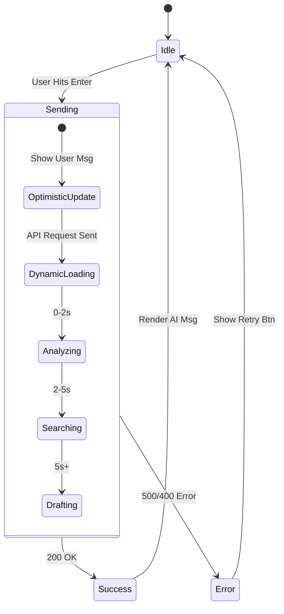

# مخطط إعادة هندسة الواجهة الأمامية (Frontend Refactoring Blueprint)

## الهدف العام
تحويل `ChatPage.tsx` إلى واجهة دردشة قانونية "فخمة" (Premium) تتعامل بذكاء مع زمن الاستجابة الطويل (Latency) وعدم وجود Streaming، مع ضمان تجربة مستخدم سلسة واسترجاع دقيق للتاريخ.

---

## 1. 🏗️ استراتيجية دمج المكونات (Component Consolidation)

سنقوم بإلغاء التشتت الحالي عبر دمج ميزات `ChatInterface` داخل مكونات فرعية نظيفة يتم استدعاؤها في `ChatPage`.

### الهيكلية الجديدة المقترحة (Component Hierarchy)

```mermaid
graph TD
    Page[ChatPage (Smart Container)]
    Page --> |State & Logic| ChatContainer[ChatContainer (Layout)]
    
    ChatContainer --> Header[ChatHeader (Session Title + Status)]
    ChatContainer --> MessageList[MessageList (Scroll Area)]
    ChatContainer --> InputArea[InputArea (Text + Voice)]
    
    MessageList --> SmartBubble[SmartBubble (Markdown/RTL)]
    MessageList --> ToolIndicator[ToolIndicator (Collapsible Accordion)]
    MessageList --> LoadingState[DynamicLoadingState (Skeleton)]
    
    InputArea --> AttachmentBtn[Attachment Button]
    InputArea --> VoiceBtn[Voice Input]
```

*   **`ChatPage` (The Brain):** تدير الـ `sessions`, `apiClient`, والـ `hydration`.
*   **`MessageList` (The Body):** مسؤولة عن عرض القائمة والـ Auto-scroll.
*   **`SmartBubble`:** تعرض رسائل المستخدم والمساعد.
*   **`ToolIndicator`:** مكون جديد تماماً لعرض رسائل النظام المخفية (`role: tool`).

---

## 2. ⏳ إدارة زمن الاستجابة (Latency Experience)

بما أن الطلب قد يستغرق 10-5 ثوانٍ، الاعتماد على "Spinner" عادي سيشعر المستخدم بالملل أو أن النظام "عالق".

### الحل: حالة تحميل ديناميكية (Dynamic Loading State)

سنقوم بإنشاء مكون `DynamicLoadingState` يعرض رسائل متغيرة أثناء الانتظار:

1.  **الثانية 0-2:** "جاري تحليل الطلب..." (Analyzing Request)
2.  **الثانية 2-5:** "البحث في القوانين والسوابق..." (Consulting Legal Database)
3.  **الثانية 5-8:** "صياغة الرد القانوني..." (Drafting Response)
4.  **الثانية 8+:** "لمسات أخيرة..." (Finalizing)

### مخطط تدفق الحالة (State Flow)



*   **Locking:** حقل الإدخال يجب أن يكون `disabled` أثناء حالة `Sending` لمنع التكرار (Debounce).

---

## 3. 🧠 منطق عرض الرسائل (Smart Bubble Logic)

### أ. رسائل المساعد (`role: assistant`)
*   **Markdown:** استمرار استخدام `react-markdown` مع تحسين تنسيق الجداول (Bordered Tables) والاقتباسات (Blockquotes) لتناسب المذكرات القانونية.
*   **RTL:** التأكد من `dir="rtl"` لكل حاوية رسالة.

### ب. رسائل الأدوات (`role: tool`) - التحدي الأكبر
البيانات القادمة من الباك إند تحتوي على سجلات البحث. لا نريد عرضها كـ "فقاعة دردشة".
**التصميم المقترح:**
*   **Accordion (أكورديون):** شريط رفيع رمادي/ذهبي.
*   **العنوان:** "تم استخدام أداة: بحث في القضايا" (أيقونة 🛠️).
*   **الحالة:** مغلق (Collapsed) افتراضياً.
*   **عند الفتح:** يعرض ملخص JSON أو النص المرتجع بخط صغير (Monospace) للمراجعة التقنية إذا لزم الأمر.

**مثال للكود (Pseudo-code):**
```tsx
if (msg.role === 'tool') {
  return (
    <div className="w-full flex justify-center my-2">
      <CollapsibleTool 
         title={`System Tool: ${msg.tool_name || 'Database Query'}`} 
         content={msg.content} 
      />
    </div>
  );
}
```

---

## 4. 🔄 استرجاع البيانات والحالة (Data Hydration)

### مشكلة التكرار (Duplication Risk)
عند إرسال رسالة جديدة، نضيفها "تفاؤلياً" (Optimistically) للـ State. بعد الرد، نقوم بإعادة جلب القائمة من السيرفر.
**الحل:** استخدام `Set` أو التحقق من `id` لمنع التكرار.

### مخطط الاسترجاع (useEffect Logic)
1.  **On Mount:** `fetchSessionMessages(sessionId)`.
2.  **On Send:**
    *   `setMessages(prev => [...prev, optimisticMsg])`
    *   `setIsLoading(true)`
    *   `await api.send(...)`
    *   `fetchSessionMessages(sessionId)` (لضمان تطابق الحالة مع السيرفر وترتيب الأدوات).

---

## 5. 🛑 تحليل الفجوات في التصميم (Design Gap Analysis)

| العنصر | الحالة الحالية | التعديل المطلوب (Refactoring) |
| :--- | :--- | :--- |
| **Tool Messages** | تظهر كرسائل عادية أو مخفية | تحويلها إلى **Indications** (مؤشرات) بصرية أنيقة. |
| **Loading** | Dots Animation بسيطة | تحويلها إلى **Skeleton Loader** مع نصوص متغيرة. |
| **Retry** | غير موجود | إضافة زر "إعادة المحاولة" ↻ بجانب رسالة الخطأ. |
| **Scroll** | بسيط | إضافة زر "Scroll to Bottom" يظهر عند الصعود للأعلى. |

## الخلاصة
الخطة تركز على "خداع الوقت" (Time Perception) عبر واجهة تفاعلية تشعر المستخدم أن المحامي الذكي "يفكر" فعلياً، مع تنظيف الكود ليكون قابلاً للصيانة.
