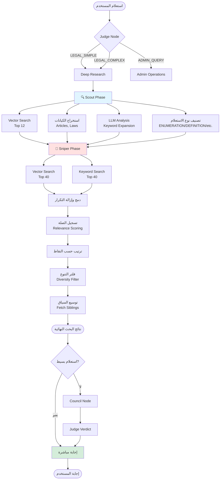
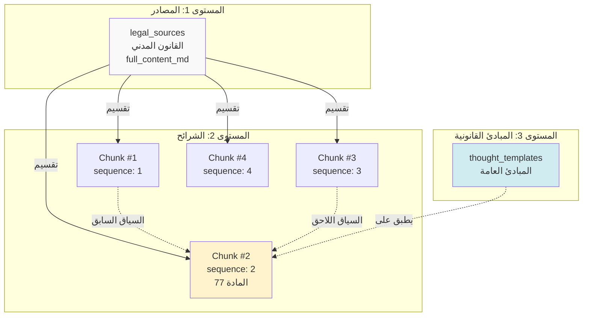
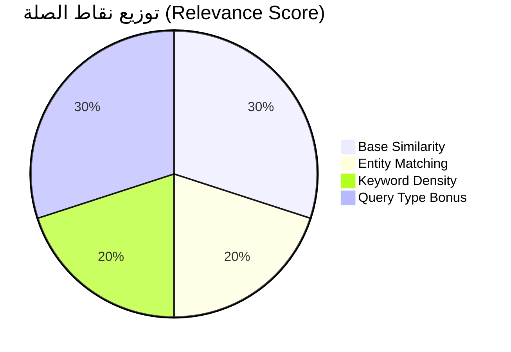
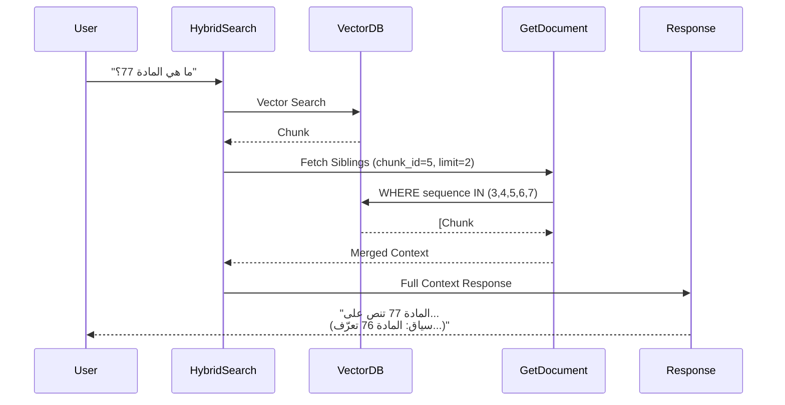
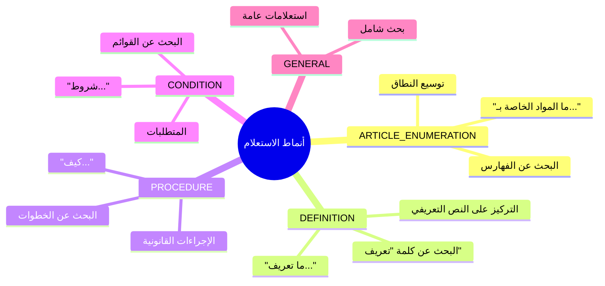
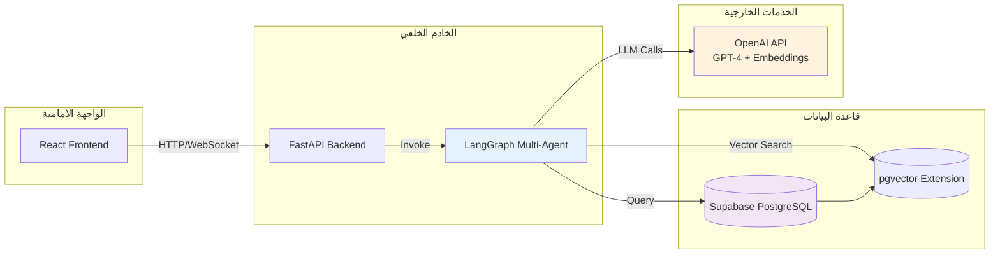
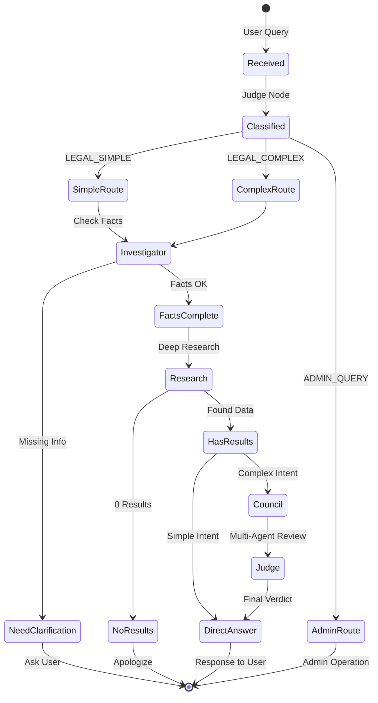
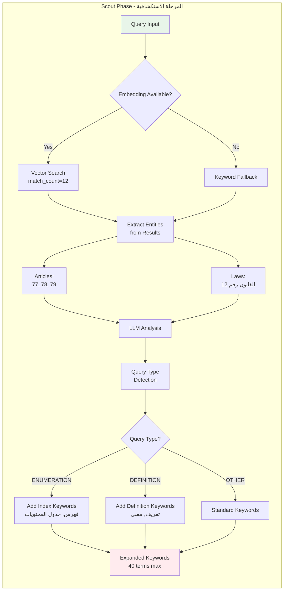
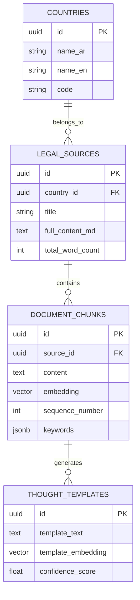

# مخططات توضيحية لنظام البحث القانوني

## 1. مسار البحث الهجين (Hybrid Search Flow)

## 2. هندسة قاعدة المعرفة الطبقية

## 3. نموذج التسجيل (Scoring Model)

## 4. تدفق استرجاع السياق (Context Retrieval)

## 5. أنماط الاستعلام ومعالجتها

## 6. معمارية النظام الشاملة

## 7. دورة حياة الاستعلام (Query Lifecycle)

## 8. تفصيل Scout Phase

## 9. نموذج البيانات (Data Model)

---

**تم إنشاؤه:** 2026-02-05  
**الغرض:** توضيح معماري لنظام البحث القانوني
